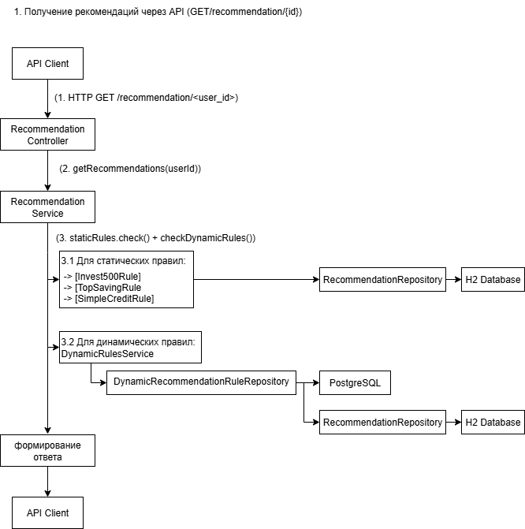

Диаграмма компонентов:

*   **Внешние системы:** API-клиенты и Telegram Server взаимодействуют с контроллерами по HTTP.
*   **Базы данных:** H2 используется только для чтения исходных данных, PostgreSQL — для хранения динамических правил.

Внешние системы: Telegram Server, API Client (например, Postman или фронтенд).

Базы данных: H2 (только для чтения, исходные данные), PostgreSQL (для чтения/записи, динамические правила).

Диаграмма деятельности (Activity Diagram) для выдачи рекомендаций:
