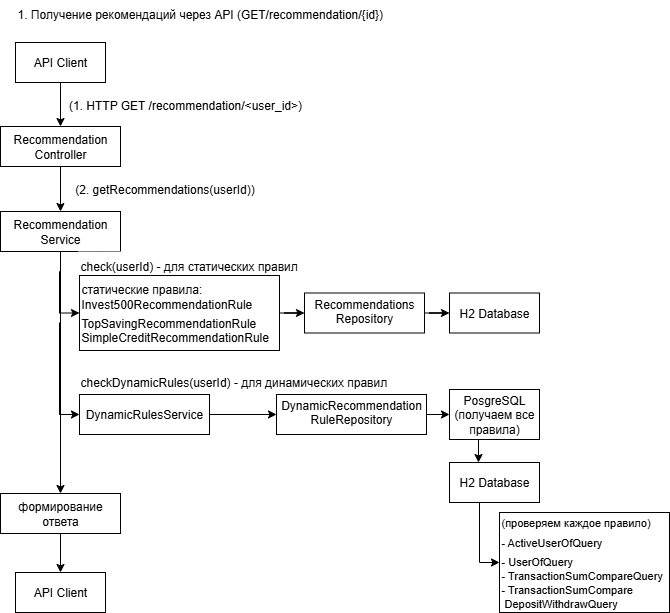

Диаграмма компонентов:

*   **Внешние системы:** API-клиенты и Telegram Server взаимодействуют с контроллерами по HTTP.
*   **Базы данных:** H2 используется только для чтения исходных данных, PostgreSQL — для хранения динамических правил.

Внешние системы: Telegram Server, API Client (например, Postman или фронтенд).

Базы данных: H2 (только для чтения, исходные данные), PostgreSQL (для чтения/записи, динамические правила).

## Диаграмма деятельности

Алгоритм формирования рекомендаций для пользователя:

1.  Система проверяет все статические правила (жестко заданные в коде).
2.  Затем загружает все динамические правила из базы данных.
3.  Для каждого динамического правила вычисляется результат на основе запросов (QUERY).
4.  Если правило срабатывает, увеличивается счетчик его срабатываний и продукт добавляется в результат.
5.  Формируется и возвращается итоговый ответ с рекомендациями.